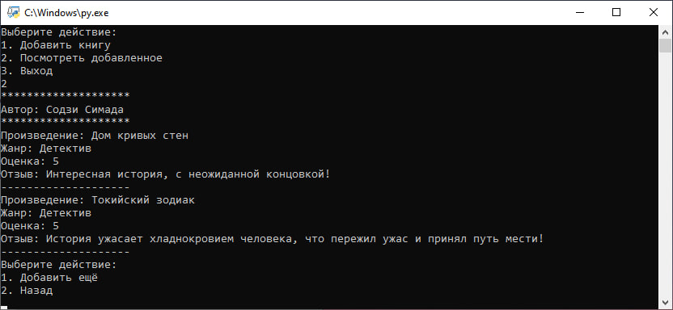

# 🧪 Тестовая документация для библиотечной системы

## 📌 Объект тестирования
Консольное приложение для управления коллекцией книг с функциями:
- Добавление книг (новых и существующим авторам)
- Просмотр добавленных книг
- Хранение данных в текстовых файлах

## 🌡️ Текущий статус тестирования
**Базовое тестирование**  
Основной функционал требует проверки, система хранения данных нуждается в дополнительных тестах.

---

## 🔍 Тест-кейсы

### 1. Основное меню
| ID | Действие | Ожидаемый результат | Статус |
|----|----------|---------------------|--------|
| M1 | Выбор "1. Добавить книгу" | Переход в меню добавления | ✅ |
| M2 | Выбор "2. Посмотреть добавленное" | Отображение списка книг | ✅ |
| M3 | Выбор "3. Выход" | Корректное завершение программы | ✅ |

### 2. Добавление книг
**Предусловие**: Существование папки `books/`

| ID | Действие | Ожидаемый результат | Статус |
|----|----------|---------------------|--------|
| A1 | Добавление нового автора | Создается файл автора | ✅ |
| A2 | Добавление к существующему автору | Данные дописываются в файл | ✅ |
| A3 | Ввод некорректного номера автора | Сообщение об ошибке | 🟡 Требует доработки |
| A4 | Пустые поля при добавлении | Данные сохраняются с пустыми значениями | ❌ Дефект |

### 3. Просмотр книг
| ID | Действие | Ожидаемый результат | Статус |
|----|----------|---------------------|--------|
| V1 | Просмотр при пустой библиотеке | Сообщение об отсутствии книг | ❌ Не реализовано |
| V2 | Просмотр после добавления | Корректное отображение всех данных | ✅ |

---

## 🐛 Известные дефекты
1. **ID**: LIB-001  
   **Описание**: Нет обработки пустых полей при добавлении книги  
   **Серьезность**: Средняя  
   **Статус**: Открыт

2. **ID**: LIB-002  
   **Описание**: Нет проверки формата оценки (допускаются значения вне диапазона 1-5)  
   **Серьезность**: Низкая  
   **Статус**: В работе

---

## 🛠 Тестовая среда
- **ОС**: Windows/Linux/macOS
- **Python**: 3.7+
- **Требуемые папки**: `books/` (создается вручную)
