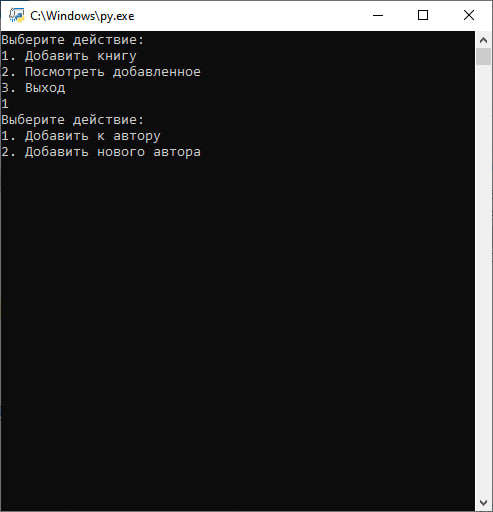

# Person Library (Персональная библиотека)
---
Данный проект офрмлен в виде консольного приложения и является личной библиотекой, куда человек может добавить список своих прочитанных книг.

### Внешний вид и функции
##### В самом начале нас встречает три варианта событий:
1. Добавить автора
2. Посмотреть добавленное
3. Выход

##### После перехода к добавлению автора, есть несколько вариантов:
1. Добавить к автору
2. Добавить нового автора

В зависимости от выбора, вас ждёт несколько вариантов развития событий, они похожи между собой, в них мы прописываем:
- Автора
- Произведение
- Жанр
- Оценку
- Отзыв

Во втором случае автора вводить не нужно.

##### Просмотр добавленных авторов и произведений

